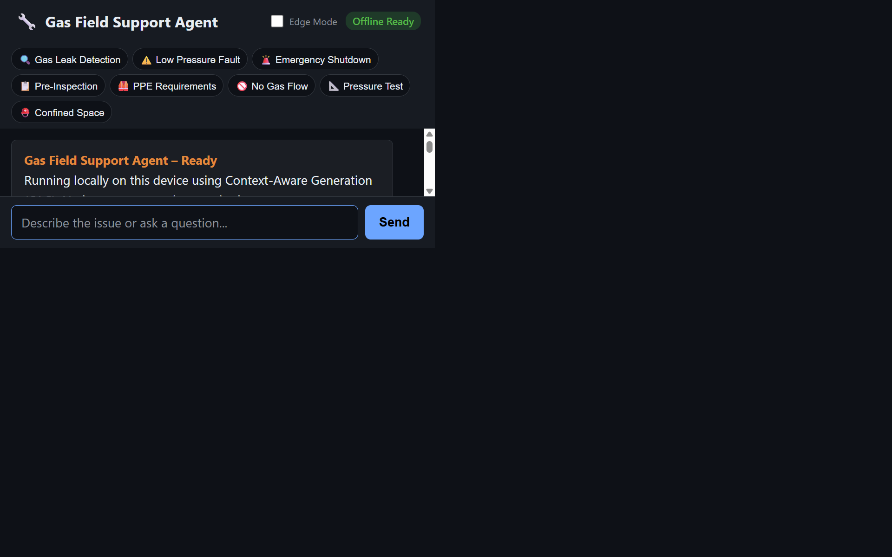
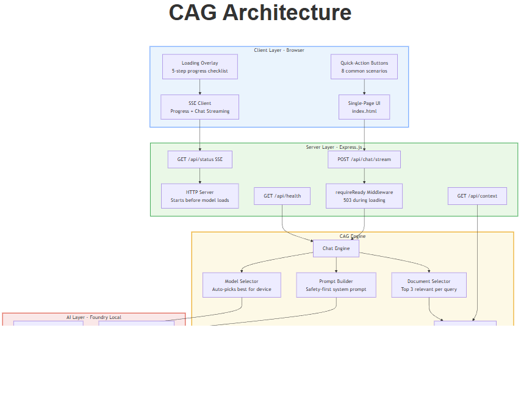
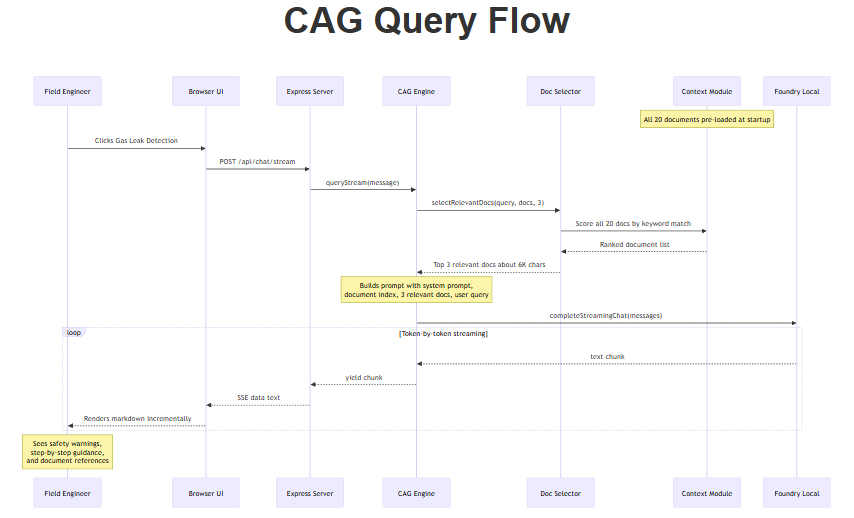
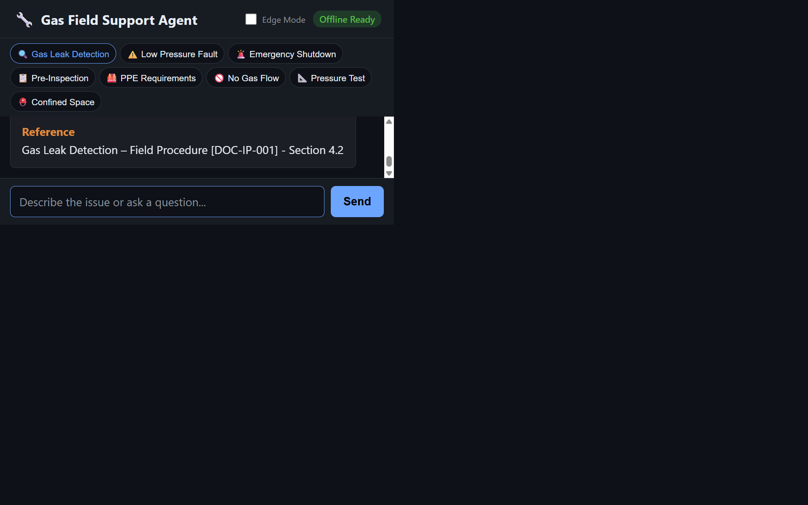
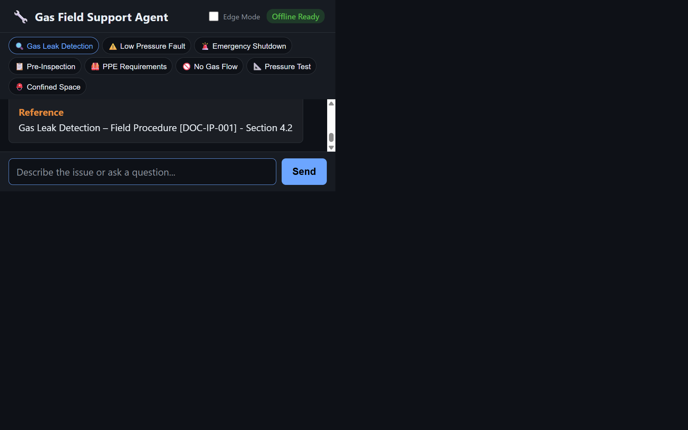
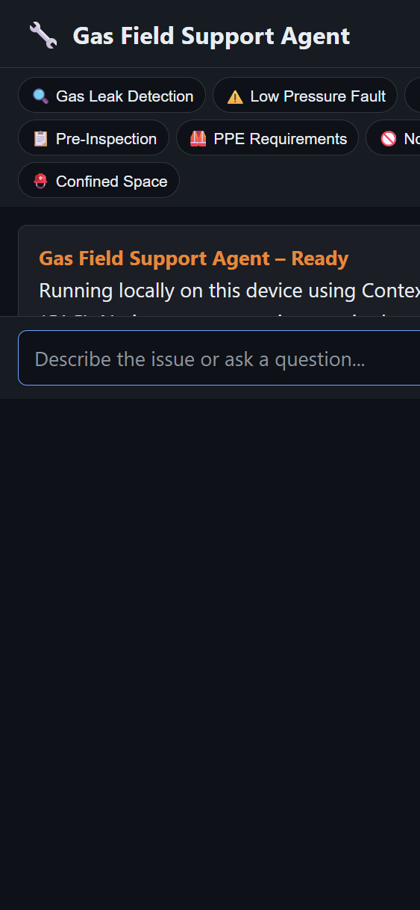
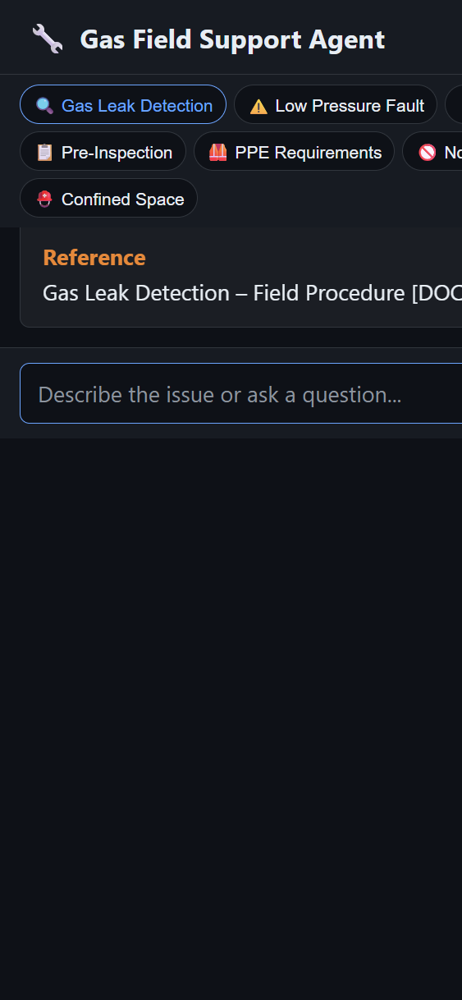

# Build a Fully Offline CAG App with Foundry Local: No Cloud Required

*A hands-on guide to building a mobile-responsive, on-device AI support agent using Context-Augmented Generation, JavaScript, and Foundry Local.*

---

You've probably heard the AI pitch: "just call our API." But what happens when you're a gas field engineer standing next to a pipeline in the middle of nowhere, with no Wi-Fi, no cell signal, and a procedure you need right now?

That's the scenario that motivated this project: a **fully offline CAG-powered support agent** that runs entirely on a laptop. No cloud. No API keys. No outbound network calls. Just a local model, 20 gas engineering documents pre-loaded into the prompt, and a browser-based UI that works on any device.

In this post, I'll walk you through how it works, how to build your own, and the architectural decisions that make it all fit together.



## What is CAG and Why Should You Care?

**Context-Augmented Generation (CAG)** is a pattern that makes AI models useful for domain-specific tasks. Instead of hoping the model "knows" the answer from training, you pre-load your entire knowledge base into the model's context window at startup. Every query the model handles has access to all of your documents, all of the time.

CAG differs from the more commonly discussed **RAG** (Retrieval-Augmented Generation) pattern. In RAG, relevant chunks are retrieved from a vector database at query time. In CAG, all documents are injected into the system prompt upfront. There is no retrieval step, no vector database, and no embeddings.

The result: fewer hallucinations, simpler architecture, and an AI that works with *your* content.

> **Want to compare approaches?** See [local-rag](https://github.com/leestott/local-rag) for a RAG-based implementation of the same scenario using vector search and embeddings.

If you're building internal tools, customer support bots, field manuals, or knowledge bases with a small, curated document set, CAG is a powerful pattern to consider.

## The Stack

This project is intentionally simple. No frameworks, no build steps, no Docker:

| Layer | Technology | Why |
|-------|-----------|-----|
| **AI Model** | [Foundry Local](https://foundrylocal.ai) + auto-selected model | Runs locally via native SDK bindings, no GPU needed; best model chosen for your device |
| **Backend** | Node.js + Express | Lightweight, fast, everyone knows it |
| **Context** | All docs pre-loaded into the prompt at startup | No vector database, no embeddings, no retrieval step |
| **Frontend** | Single HTML file with inline CSS | No build step, mobile-responsive, field-ready |

The total dependency footprint is two npm packages: `express` and `foundry-local-sdk`.

## Getting Started

### Prerequisites

You need two things:

1. **Node.js 20+**: [nodejs.org](https://nodejs.org/)
2. **Foundry Local**: Microsoft's on-device AI runtime:
   ```
   winget install Microsoft.FoundryLocal
   ```

Foundry Local will auto-select the best model for your device and download it the first time you run the app. Set `FOUNDRY_MODEL=<alias>` to force a specific model.

### Setup

```bash
git clone https://github.com/leestott/local-cag.git
cd local-cag
npm install
npm start        # Starts server, selects model, and shows progress in the browser
```

Open `http://127.0.0.1:3000` in your browser. You will see a loading overlay with a progress bar whilst the model downloads (first run) and loads into memory. Once ready, the overlay fades away and you can start chatting. There is no ingestion step and no database setup.

## Architecture Overview



The system has four layers, all running on a single machine:

- **Client Layer**: a single HTML file served by Express, with quick-action buttons and a responsive chat interface
- **Server Layer**: Express.js starts immediately and begins serving the UI and an SSE status endpoint; API routes handle chat (streaming and non-streaming), context listing, and health checks
- **CAG Engine**: the chat engine loads all domain documents at startup, selects the most relevant ones per query using keyword scoring, and injects them into the prompt; the prompts module provides safety-first system instructions
- **AI Layer**: Foundry Local runs the auto-selected model on CPU/NPU via native SDK bindings (in-process inference, no HTTP round-trips)

A key design decision: the HTTP server starts *before* the model finishes loading. This allows the browser to connect immediately and receive real-time progress updates via Server-Sent Events whilst the model downloads and loads into memory.

## How the CAG Pipeline Works

Let's trace what happens when a user asks: **"How do I detect a gas leak?"**



### Step 1: Server Start and Visual Progress

When you run `npm start`, the Express server starts immediately on port 3000. If you open the browser at this point, you see a loading overlay with a progress bar and a step-by-step checklist:

1. Load domain documents
2. Initialise Foundry Local SDK
3. Select best model for device
4. Ensure model is available (download progress shown as a percentage bar)
5. Load model into memory

The server broadcasts initialisation status to all connected browsers via an SSE endpoint (`/api/status`). Chat endpoints return 503 whilst the model is loading, so the UI cannot send queries before the engine is ready.

### Step 2: Document Loading

The context module (`src/context.js`) reads all `.md` files from the `docs/` folder:

1. Reads every `.md` file and parses optional YAML front-matter (title, category, ID)
2. Groups documents by category (Safety, Inspection, Fault Diagnosis, etc.)
3. Builds a document index listing all available topics so the model knows what knowledge exists
4. Also builds a compact variant (safety warnings and key procedure steps only) for edge mode

There is no chunking, no vector computation, and no database. The documents are held in memory as plain text and selected per query.

### Step 3: User Query

Once the loading overlay fades away, the user sends "How do I detect a gas leak?" and the server receives the message and passes it to the chat engine.

### Step 3: Prompt Construction

The chat engine selects the top 3 most relevant documents for the user's query using keyword scoring, then builds a messages array:

```
System: You are an offline gas field support agent. Safety-first...
System (document index): [List of all 20 available topics]
System (relevant context): [Top 3 matching documents, ~6K chars]
...conversation history...
User: How do I detect a gas leak?
```

Rather than injecting all 20 documents (~41K chars) into every prompt, only the most relevant ones are included. The full document index is always present so the model knows what other topics are available. This keeps prompts small enough for efficient CPU inference whilst still grounding answers in domain knowledge.

### Step 4: Generation and Streaming

The prompt is sent to the locally loaded model via the Foundry Local SDK's native bindings (in-process, not via HTTP). The response streams back token-by-token through Server-Sent Events (SSE) to the browser:





## Foundry Local: Your Local AI Runtime

[Foundry Local](https://foundrylocal.ai) is what makes the "offline" part possible. It's a local runtime from Microsoft that:

- Runs small language models (SLMs) on CPU or NPU, with no GPU required
- Provides native SDK bindings for direct in-process inference (no local HTTP server needed)
- Manages model downloads, caching, and lifecycle automatically
- Provides real-time download progress callbacks for UI integration
- Works through the `foundry-local-sdk` npm package

The integration code is minimal:

```js
import { FoundryLocalManager } from "foundry-local-sdk";

// Create a manager and resolve the model from the catalogue
const manager = FoundryLocalManager.create({ appName: "gas-field-cag" });
// Auto-select the best model for this device based on available RAM,
// or use a specific alias via the FOUNDRY_MODEL environment variable
const models = await manager.catalog.getModels();
// Dynamic selection logic picks the largest model that fits in RAM
const model = selectBestModel(models);  // see src/modelSelector.js

// Download if not cached (with progress callback), then load into memory
if (!model.isCached) {
  await model.download((progress) => {
    console.log(`Download: ${progress.toFixed(0)}%`);
  });
}
await model.load();

// Create a chat client for direct in-process inference
const chatClient = model.createChatClient();
chatClient.settings.temperature = 0.1;

// Send messages and get completions
const response = await chatClient.completeChat([
  { role: "system", content: "You are a helpful assistant." },
  { role: "user", content: "How do I detect a gas leak?" }
]);
```

This uses native bindings for in-process inference. There are no HTTP round-trips to a local server, which reduces latency and simplifies the architecture.

## Why CAG Instead of RAG?

Most AI tutorials use RAG with embedding models and vector databases. We chose CAG for this project because:

1. **Simpler architecture**: no chunking pipeline, no embeddings, no vector database, no retrieval step
2. **Relevant context**: the engine selects the most relevant documents per query and always includes a full topic index, so the model never loses awareness of available knowledge
3. **Zero retrieval latency**: documents are already in memory; keyword scoring is near-instant compared to embedding and similarity search
4. **Minimal dependencies**: just two npm packages (`express` and `foundry-local-sdk`), no `better-sqlite3`, no embedding library
5. **Efficient on CPU**: by selecting only the top 3 documents per query (~6K chars instead of ~41K), even 7B models respond quickly on CPU

### When to Consider Switching to RAG

CAG works best for small, curated document sets. If your use case grows beyond the model's context window, consider switching to RAG:

- **Hundreds or thousands of documents** that exceed the context window
- **Dynamic document collections** that change frequently and are too large to reload
- **Precision-critical retrieval** where only the most relevant chunks should be included to optimise generation quality

For the current use case (20 short procedural guides on constrained local hardware), CAG delivers the best balance of simplicity, reliability, and answer quality.

## Building a Mobile-Responsive Field UI

Field engineers use this app on phones and tablets, often wearing gloves. The UI is designed for harsh conditions:

- **Dark, high-contrast theme** with large text (18px base)
- **Large touch targets** (minimum 48px) for gloved operation
- **Quick-action buttons** for common questions, so no typing is needed
- **Responsive layout** that works from 320px to 1920px+

| Desktop | Mobile |
|---------|--------|
|  |  |

The mobile view horizontally scrolls the quick-action bar and adjusts text sizes:



The entire frontend is a single `index.html` file, with no React, no build step, and no bundler. This is intentional: it keeps the project accessible to beginners and makes it easy to deploy to any static file server.

### Responsive CSS Approach

The key responsive breakpoints:

```css
/* Tablet: 900px */
@media (max-width: 900px) {
  .message { max-width: 95%; }
  .quick-btn { padding: 6px 10px; font-size: 0.78rem; }
}

/* Mobile: 600px */
@media (max-width: 600px) {
  html { font-size: 16px; }
  .message { max-width: 98%; padding: 10px 14px; }
  #quick-actions {
    overflow-x: auto;
    flex-wrap: nowrap;
    -webkit-overflow-scrolling: touch;
  }
}
```

## Adding Documents

To expand the knowledge base, add `.md` files to the `docs/` folder and restart the server. Documents are loaded at startup and injected into the system prompt automatically.

### Document Format

```markdown
---
title: Troubleshooting Widget Errors
category: Support
id: KB-001
---

# Troubleshooting Widget Errors
...your content here...
```

## Safety-First Prompting

For safety-critical domains like gas field operations, the system prompt is engineered to:

1. **Always surface safety warnings first**, before any procedural steps
2. **Never hallucinate** procedures, measurements, or legal requirements
3. **Cite sources**: every response references the specific document and section
4. **Fail gracefully**: if the information is not in the pre-loaded context, the agent says so explicitly

```
Format: Summary → Safety Warnings → Step-by-step Guidance → Reference
```

This pattern is transferable to any safety-critical domain: medical devices, electrical work, aviation maintenance, chemical handling.

## Adapting This for Your Own Domain

This project is a **scenario sample**, designed to be forked and adapted. Here is how to make it yours:

### 1. Replace the Documents

Delete the gas engineering docs in `docs/` and add your own `.md` files. The context module handles any markdown content with optional YAML front-matter.

### 2. Edit the System Prompt

Open `src/prompts.js` and rewrite the system prompt for your domain. The structure works for any support or knowledge base scenario:

```js
export const SYSTEM_PROMPT = `You are an offline support agent for [YOUR DOMAIN].

Rules:
- Only answer using the provided context
- If the answer is not in the context, say so
- Use structured responses: Summary → Details → Reference
`;
```

### 3. Override the Model

By default the app auto-selects the best model for your device. To force a specific model, set the `FOUNDRY_MODEL` environment variable:

```bash
foundry model list                     # See available models
FOUNDRY_MODEL=phi-3.5-mini npm start   # Force a smaller, faster model
```

Smaller models give faster responses on constrained devices. Larger models give better quality. The auto-selector picks the largest model that fits within 60% of your system RAM.

### 4. Customise the UI

The frontend is a single HTML file with inline CSS. Edit it directly to match your branding and domain.

## Running Tests

The project includes unit tests using the built-in Node.js test runner:

```bash
npm test
```

Tests cover configuration and server endpoints, with no extra test framework needed.

## What's Next?

Some ideas for extending this project:

- **Conversation memory**: persist chat history across sessions
- **Multi-modal support**: add image-based queries (e.g., photographing a fault code)
- **PWA packaging**: make it installable as a standalone app on mobile devices
- **Hybrid CAG + RAG**: add a retrieval step for larger document collections that exceed the context window

## Summary

Building a local CAG application does not require a PhD in machine learning or a cloud budget. With Foundry Local, Node.js, and a set of domain documents, you can create a fully offline, mobile-responsive AI agent that answers questions grounded in your own content.

The key takeaways:

1. **CAG = Context + Augment + Generate**: pre-load your documents, inject them into the prompt, and let the model generate grounded answers
2. **Foundry Local** makes local AI accessible: native SDK bindings, in-process inference, no GPU required
3. **No infrastructure needed**: no vector database, no embeddings, no retrieval pipeline
4. **Mobile-first design** matters for field applications
5. **Safety-first prompting** is essential for critical domains

Clone the repo, swap in your own documents, and start building.

---

*This project is open source under the MIT licence. It is a scenario sample for learning and experimentation, not production medical or safety advice.*
